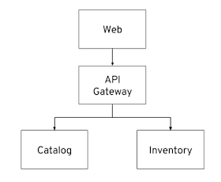

In this lab you will learn about Node.js and will deploy the Node.js and Angular-based 
web front+end for the CoolStore online shop which uses the API Gateway services you deployed 
in previous labs. 

#### What is Node.js?

Node.js is an open source, cross-platform runtime environment for developing server-side 
applications using JavaScript. Node.js has an event-driven architecture capable of 
non-blocking I/O. These design choices aim to optimize throughput and scalability in 
Web applications with many input/output operations, as well as for real-time web applications.

Node.js non-blocking architectures allows applications to process large number of 
requests (tens of thousands) using a single thread which makes ia desirable choice for building 
scalable web applications.
